# Ecosystem

```mermaid
flowchart LR
  A["Operational problem"] --> B["Clean-room open-source system"]
  B --> C["GitHub repository"]
  C --> D["Working public demonstration"]
  D --> E["Technical case study"]
  E --> F["Training course"]
  F --> G["Reusable templates"]
  G --> H["Local MCP integration"]
  H --> I["SEO-indexed portfolio page"]
  I --> J["Social education content"]
```

The Systems Lab turns generic administrative workflow problems into reusable software, documentation and learning assets. Each project must prove its value with working code, synthetic data, tests, privacy review and clear limitations.
