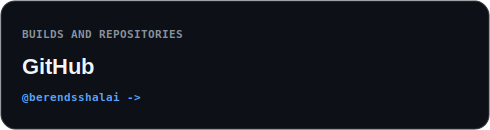
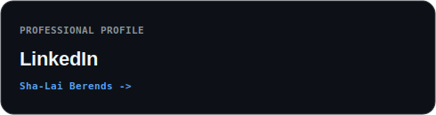
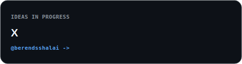
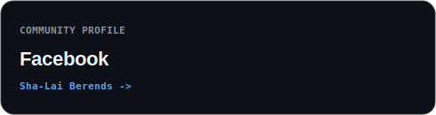
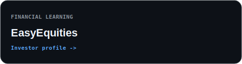
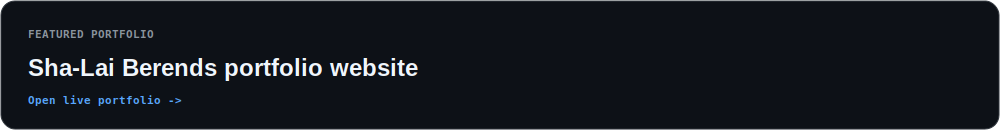

# Sha-Lai Berends Systems Lab

Practical open-source systems for payroll, workforce operations, reconciliation, recruitment and administrative automation.

This control repository defines the clean-room standards, shared tooling, project registry and publication gates for a family of reusable public systems by Sha-Lai Berends.

## Public Identity

Sha-Lai Berends is a South African business-automation and data-operations builder creating privacy-conscious, auditable and practical workflow systems.

## What This Repository Contains

- Clean-room publication policy and privacy gate.
- GitHub-ready repository standards.
- Synthetic-data strategy.
- SEO, course, MCP and social content plans.
- A first flagship scaffold: Attendance Reconciliation Engine.

## Public Pages

- [Systems Lab website](https://berendsshalai.github.io/berendsshalai-systems-lab/)
- [Check My Socials](https://berendsshalai.github.io/berendsshalai-systems-lab/socials/)

## Check My Socials

<p align="center">
  <a href="https://github.com/berendsshalai"></a>
  <a href="https://www.linkedin.com/in/sha-lai-berends"></a>
  <a href="https://x.com/berendsshalai"></a>
  <a href="https://www.instagram.com/berendsshalai"></a>
  <a href="https://www.facebook.com/p/Sha-Lai-Berends-61591546301365/"></a>
  <a href="https://bit.ly/3sA5312"></a>
  <a href="https://sha-lai-be-2a6c6108-shalaiberends.wix-site-host.com"></a>
</p>

<p align="center"><strong><a href="https://berendsshalai.github.io/berendsshalai-systems-lab/socials/">Open the complete Check My Socials experience →</a></strong></p>

## Local Verification

From a fresh clone:

```bash
python tools/release_check.py
```

To work on the first flagship project directly:

```bash
cd projects/attendance-reconciliation-engine
python -m pip install -e .
python -m pytest tests
```

## Publication Status

Public foundation release. Shared standards, publication controls and the flagship scaffold are available for inspection. Individual components remain subject to their documented maturity, privacy review and release status.

## Non-Affiliation

These projects are independent public implementations based on common operational problems. They are not endorsed by, affiliated with, or representative of any employer, client, franchise, platform or private organisation.
