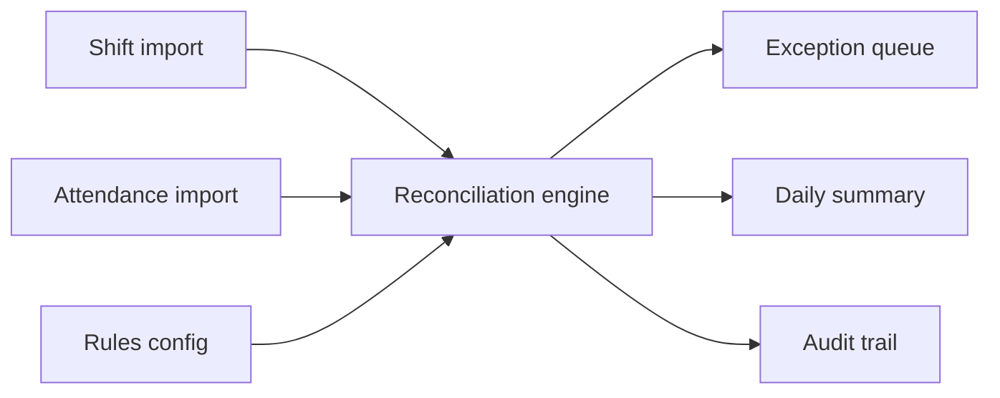

# Architecture

The deterministic core lives in `src/attendance_reconciliation/engine.py`. Adapters parse CSV and JSON into dataclasses. Reports are plain dictionaries so they can be exported to JSON, CSV or browser views.
